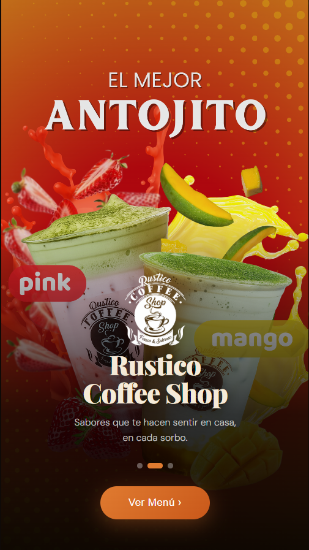
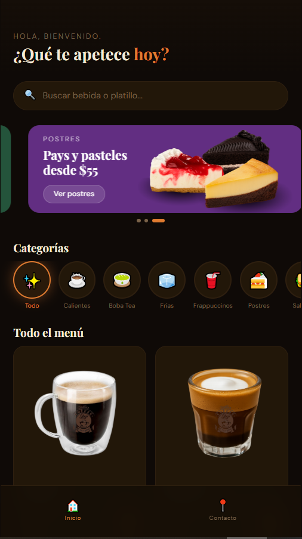

# Rustico Coffee Shop Website

Rustico Coffee Shop is a responsive website developed for a local coffee shop. The project focuses on modern design, accessibility, and user experience across desktop and mobile devices.

## Technologies

- HTML
- CSS
- JavaScript

## Features

- Responsive design for desktop and mobile devices
- Modern and user-friendly interface
- Product showcase for drinks, desserts, and food items
- Image carousel and interactive elements

## Project Structure

```
Rustico_Coffee_Shop-main
├── BEBIDAS                ← Image folders
├── CARRUSEL
├── INICIO
├── LOGO
├── POSTRES
├── SALADOS
│
├── index.html             ← Main page
├── main.js                ← JavaScript functionality
└── style.css              ← Main stylesheet
```

## Live Demo

https://jariojedadev.github.io/rustico-coffee-shop-website/


<h2 align="center">Preview</h2>

<p align="center">
  
</p>

<p align="center">
  
</p>
